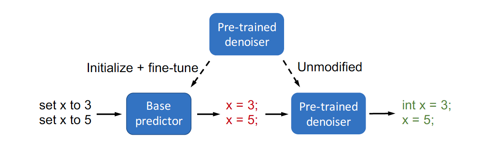
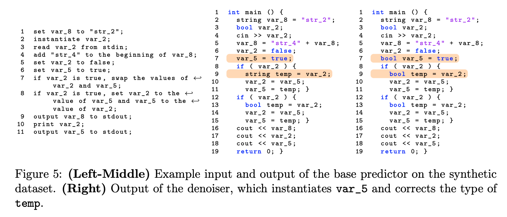

# Composed Fine-Tuning: Freezing Pre-Trained Denoising Autoencoders for Improved Generalization (ICML 2021)

This repo provides the code accompanying the [paper](https://arxiv.org/abs/2006.16205) "Composed Fine-Tuning: Freezing Pre-Trained Denoising Autoencoders for Improved Generalization", which proposes composed fine-tuning for improving fine-tuning from pre-trained denoising autoencoders in prediction problems with high-dimensional outputs.
In this framework, we first use "unlabeled" output data, i.e. outputs without corresponding inputs that are often freely available, the learn a denoiser from perturbed, noisy outputs to valid outputs. We then train a predictor composed with this (fixed) denoiser, leveraging the output structure learned by the denoiser to improve generalization.
Composed fine-tuning can leverage unlabeled output data to improve models especially in situations when there is only a small amount of labeled data available, and also improve OOD performance.

We provide experiments on both images and text:
- conditional image generation (`imggen/`)
- pseudocode to code (`code/`)

If this repository was useful for you, please cite:
```
@article{xie2021composed, 
title={Composed Fine-Tuning: Freezing Pre-Trained Denoising Autoencoders for Improved Generalization}, 
author={Sang Michael Xie and Tengyu Ma and Percy Liang},
journal={International Conference on Machine Learning (ICML)}, 
year={2021} 
}
```


# Pseudocode-to-code experiments (ID and OOD generalization)

In code generation tasks, there is often a large amount of valid, unlabeled code available to learn from.
We provide a synthetic pseudocode-to-code dataset in `code/` as well as processed training data and unlabeled data for the [SPoC](https://github.com/Sumith1896/spoc) pseudocode-to-code dataset. 
Composed fine-tuning improves both in-domain and OOD performance, with larger gains OOD by preserving the output structure learned by pre-trained denoisers.




# Conditional image generation experiments (OOD generalization)

Composed fine-tuning can leverage unlabeled output data in conditional image generation, especially when there is only a small amount of labeled data available.  We demonstrate this in a font image generation experiment, where the input is the font type and character identity and the output is an image of the font.
The commands to run the experiments are in `imggen/runner.sh`.
Our experiments train a simple feedforward network for conditional image generation. We first train a U-Net to denoise unlabeled font images perturbed with a Gaussian blur filter. We then train the feedforward network composed with the (fixed) denoiser. With appropriate regularization, the feedforward network (base predictor) learns a much simpler function, without the responsibility of outputting an image with sharply defined lines. The complexity is offloaded to the denoiser, which has the advantage of having much more training data.

Here is an example of the differences between a Direct predictor trained directly to predict images and the Composed predictor. The Composed predictor as a whole outputs clearer images than the Direct predictor, while the first part of the composed predictor (the base predictor) outputs gray, blurry images that can be fit with a simple, low-norm solution.


