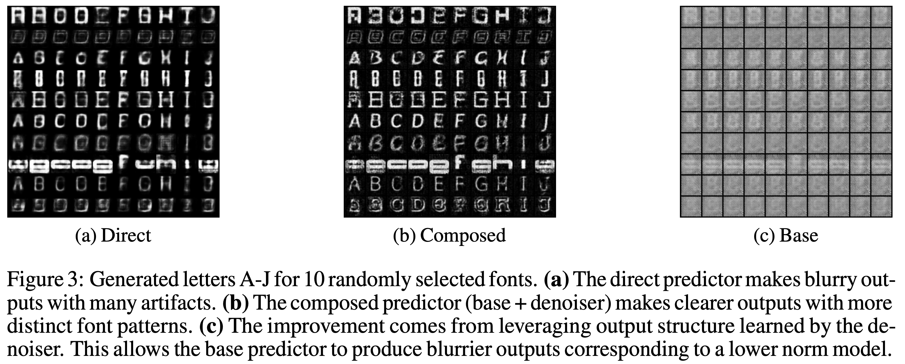

# Conditional image generation experiments

The predict-and-denoise framework can leverage unlabeled output data in conditional image generation, especially when there is only a small amount of labeled data available.  We demonstrate this in a font image generation experiment, where the input is the font type and character identity and the output is an image of the font.
The commands to run the experiments are in `runner.sh`.
Our experiments train a simple feedforward network for conditional image generation. We first train a U-Net to denoise unlabeled font images perturbed with a Gaussian blur filter. We then train the feedforward network composed with the (fixed) denoiser. With appropriate regularization, the feedforward network (base predictor) learns a much simpler function, without the responsibility of outputting an image with sharply defined lines. The complexity is offloaded to the denoiser, which has the advantage of having much more training data.

Here is an example of the differences between a Direct predictor trained directly to predict images, and the Composed predictor which factorizes the problem with the predict-and-denoise framework. The Composed predictor as a whole outputs clearer images than the Direct predictor, while the first part of the composed predictor (the base predictor) outputs gray, blurry images that can be fit with a simple, low-norm solution.

